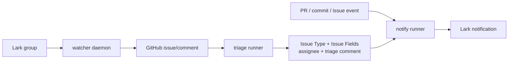
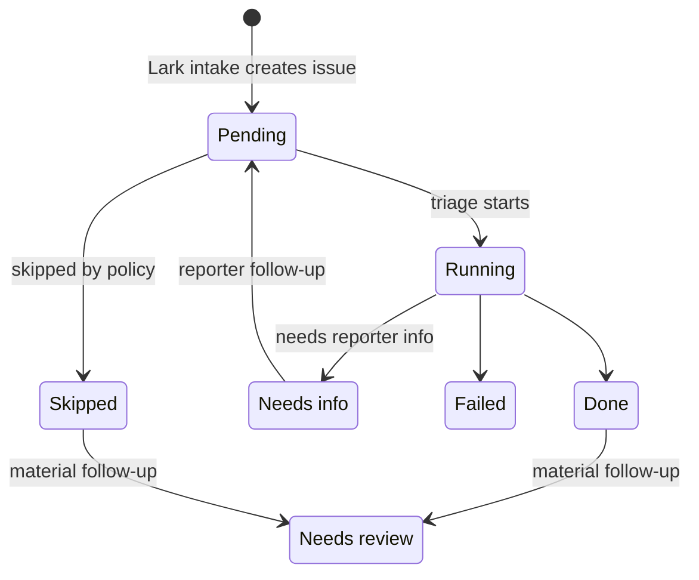

# bugpatrol

`bugpatrol` is a project-neutral bug intake, triage, and notification toolchain.
It turns Lark bug conversations into durable GitHub issue workflow state, then
runs deterministic triage and fix-notification steps around that state.

Project-specific values live in `projects/*.toml`. Product-specific migration
plans, credentials, group IDs, and rollout notes should not live in this repo.

## Principles

- Intake records what the reporter said. It does not triage.
- Triage is a separate workflow that reads GitHub issue state and local project
  context, then writes validated fields and comments.
- Fix notification is separate from triage.
- GitHub issues, comments, native Issue Type, Issue Fields, assignees, PRs, and
  commits are the durable workflow surface.
- Hidden metadata is used only for idempotency and backlinks.
- Lark is the reporter interaction surface, not the durable source of truth.

## Architecture



## Workflows

### watcher

`watcher` is a long-running daemon. It polls or receives Lark messages, normalizes
them into intake records, and creates or updates one GitHub issue per Lark topic.

Typical polling command:

```bash
python -m bugpatrol watch-lark projects/example.toml \
  --interval 30 \
  --limit 20 \
  --asset-repo \
  --event-log .bugpatrol/watch-events.jsonl \
  --lease-file .bugpatrol/watch-lark.lock \
  --processed-ledger .bugpatrol/processed-messages.json \
  --triage-queue .bugpatrol/triage-queue.json \
  --triage-dispatch-command \
    gh workflow run bugpatrol-triage.yml \
      -f issue_number={issue_number} \
      -f trigger_fingerprint={trigger_fingerprint} \
      -f reason={reason}
```

Run exactly one active watcher writer per Lark group. Multiple watcher writers
against the same group can race and create duplicate issues or comments.

When `--triage-queue` is set, watcher coalesces triage requests per issue. The
default quiet period is 60 seconds. Additional material Lark follow-ups during
that window extend the request instead of dispatching duplicate triage jobs.

Event-stream mode consumes Lark event NDJSON from stdin. Use this behind a
WebSocket event client while keeping polling as a fallback:

```bash
lark-cli event listen --format ndjson \
  | python -m bugpatrol watch-lark-events projects/example.toml \
      --asset-repo \
      --event-log .bugpatrol/watch-events.jsonl \
      --processed-ledger .bugpatrol/processed-messages.json \
      --triage-queue .bugpatrol/triage-queue.json
```

### triage

`triage` is a one-shot job. It reads an issue, comments, local PRD/docs, media
evidence, and owner data; invokes the configured agent provider; validates the
JSON result; then writes GitHub fields, assignee, and a triage comment.

Typical command:

```bash
python -m bugpatrol run-triage projects/example.toml \
  --issue 123 \
  --repo-path /path/to/project \
  --output-dir .bugpatrol/triage-123 \
  --execute
```

This is a good fit for GitHub Actions self-hosted runners because it needs local
repo context and pre-authenticated agent tooling such as `codex login`.

See `examples/github-actions/bugpatrol-triage.yml` for a project-neutral
workflow template. Copy it into the target app repo and set
`BUGPATROL_PROJECT_CONFIG` to the local project config path on the runner.

### notify

`notify` is a one-shot job. It reports fix progress from PRs, merges, linked
commits, or issue closure back to the original Lark topic, with idempotency.

Typical command:

```bash
python -m bugpatrol notify-fix projects/example.toml \
  --event pr_merged \
  --pr 123 \
  --write
```

This can run on GitHub-hosted or self-hosted runners, depending on where the
required GitHub and Lark credentials are available.

## Runner vs Daemon

| Workflow | Form | Recommended runtime | Multiplicity |
| --- | --- | --- | --- |
| watcher | daemon | systemd, launchd, tmux, or existing service host | one active writer per Lark group |
| triage | one-shot job | GitHub Actions self-hosted runner | multiple runners are OK |
| notify | one-shot job | GitHub Actions hosted or self-hosted runner | multiple runners are OK |

GitHub Actions self-hosted runners can be multiple. GitHub assigns each job to
one matching runner. The thing that must not be duplicated is the active Lark
watcher writer for the same group.

## Issue State

### Native Issue Type

`bugpatrol` uses GitHub native Issue Type:

- `Bug`
- `Feature`
- `Task`

### Triage status

Current `Triage status` values:

- `Pending`: intake created or updated the issue; triage has not completed.
- `Running`: triage is executing.
- `Needs info`: triage needs more reporter information.
- `Needs review`: material new evidence arrived after triage completed, or while
  the active triage run was using an older context.
- `Done`: triage completed and wrote fields/comment/assignee.
- `Failed`: triage execution failed.
- `Skipped`: triage was intentionally skipped.

### State flow



Follow-up Lark messages always append to the existing GitHub issue when the
`chat_id + root_id` backlink matches. Not every follow-up should retrigger
triage. The planned classifier should distinguish acknowledgements, fix/status
chatter, and material new evidence.

## Fields

Canonical logical fields:

| Field | Values |
| --- | --- |
| `Priority` | `Urgent`, `High`, `Medium`, `Low` |
| `Triage status` | `Pending`, `Running`, `Needs info`, `Needs review`, `Done`, `Failed`, `Skipped` |
| `Source` | `Lark`, `GitHub`, `Manual`, `Import` |
| `Intake version` | `v2`, `manual`, `unknown` |
| `Triage verdict` | `代码 Bug`, `PRD 错误`, `PRD 缺失`, `Case 错误`, `信息不足`, `预期行为` |
| `Platform` | `iOS`, `Android`, `Web`, `Desktop`, `多平台`, `未知` |
| `Reproducibility` | `必现`, `偶发`, `仅一次`, `未知` |
| `Other platforms` | `其他平台正常`, `其他平台也异常`, `未验证`, `不适用` |
| `Capability` | `Auth`, `Quest`, `Buddy`, `Match`, `Message`, `Me`, `Contacts`, `Notifications`, `Unknown` |
| `Evidence` | `截图`, `视频`, `日志`, `文字描述`, `多种`, `无` |
| `PRD status` | `已对齐`, `PRD 错误`, `PRD 缺失`, `未校验` |
| `Triage confidence` | `高`, `中`, `低` |
| `Owner reason` | `CODEOWNERS`, `Lark @mention`, `Git history`, `Capability fallback`, `Manual` |

Project configs map these logical names to the actual GitHub Issue Field names.

## Metadata

`bugpatrol` writes hidden HTML comments for idempotency and backlinks:

- `BUGPATROL_INTAKE_META`: source Lark chat/root/message and attachment URLs.
- `BUGPATROL_INTAKE_REPLY_META`: later Lark follow-up message references.
- `BUGPATROL_TRIAGE_META`: applied triage result fingerprint.
- `BUGPATROL_FIX_META`: sent fix notification keys.

These blocks are machine state. User-visible status should stay in GitHub native
fields and comments.

## Media

Lark image, video, and file resources can be materialized locally or uploaded to
a configured asset repository. When a media description command is configured,
resources are described before issue/comment rendering so triage can read the
generated text.

Default media command:

```bash
python -m bugpatrol.media_vision <image-or-video-path> [question]
```

It uses an OpenAI-compatible multimodal API configured by:

- `~/.bugpatrol/vision.json`
- `BUGPATROL_VISION_*` environment variables
- `~/.lark-bug-watcher/vision.json` as a compatibility fallback

## Development

```bash
python -m unittest discover -s tests
python -m unittest discover -s tests/e2e
python -m compileall bugpatrol tests
python -m bugpatrol schema
python -m bugpatrol validate-config projects/example.toml
python -m bugpatrol validate-config projects/todo-sandbox.toml
```

Useful commands:

```bash
python -m bugpatrol doctor projects/todo-sandbox.toml
python -m bugpatrol backfill-lark projects/todo-sandbox.toml --limit 20
python -m bugpatrol backfill-lark projects/todo-sandbox.toml --limit 20 --write --asset-repo
python -m bugpatrol issue-context projects/todo-sandbox.toml --issue 1 --repo-path /path/to/project
python -m bugpatrol run-triage projects/todo-sandbox.toml --issue 1 --repo-path /path/to/project
python -m bugpatrol apply-triage-result projects/todo-sandbox.toml --issue 1 --input triage-output.json --dry-run
python -m bugpatrol notify-fix projects/todo-sandbox.toml --event pr_opened --pr 12
```

## Live Tests

Live tests are opt-in and must target disposable sandbox resources.

```bash
BUGPATROL_LIVE_E2E=1 \
BUGPATROL_TODO_LARK_APP_SECRET=... \
python -m unittest tests.e2e.test_live_intake_loop

BUGPATROL_LIVE_E2E=1 \
BUGPATROL_LIVE_ASSET_E2E=1 \
BUGPATROL_LIVE_VIDEO_E2E=1 \
BUGPATROL_LIVE_ASSET_REPO=example-org/example-assets \
BUGPATROL_LIVE_ASSET_CHECKOUT=~/example-assets \
BUGPATROL_TODO_LARK_APP_SECRET=... \
python -m unittest tests.e2e.test_live_asset_resource_loop
```

Live tests must clean up test issues and test assets where the platform allows.
